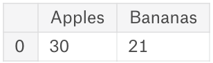
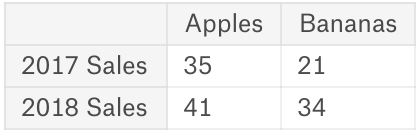
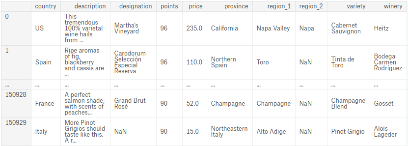

# Pendahuluan
Langkah pertama dalam sebagian besar proyek analisis data adalah membaca file data. Dalam latihan ini, Anda akan membuat objek Series dan DataFrame, baik secara manual maupun dengan membaca file data.

Jalankan sel kode di bawah ini untuk memuat pustaka yang Anda perlukan (termasuk kode untuk memeriksa jawaban Anda).


```python
import pandas as pd
pd.set_option('display.max_rows', 5)
```

## 1.

Pada sel di bawah ini, buatlah DataFrame `buah` yang terlihat seperti ini:




```python
# Kode Anda ada di sini. Buat sebuah dataframe yang sesuai dengan diagram di atas dan tetapkan ke variabel buah.
fruits = pd.DataFrame({'Apple':[30],'Bananas':[21]})
```


```python
fruits
```


<div>
<table border="1" class="dataframe">
  <thead>
    <tr style="text-align: right;">
      <th></th>
      <th>Apple</th>
      <th>Bananas</th>
    </tr>
  </thead>
  <tbody>
    <tr>
      <th>0</th>
      <td>30</td>
      <td>21</td>
    </tr>
  </tbody>
</table>
</div>


## 2.

Buatlah sebuah dataframe `fruit_sales` yang sesuai dengan diagram di bawah ini:




```python
fruit_sales = pd.DataFrame({'Apples':[35,41], 'Bananas':[21,34]}, index=['2017 Sales', '2018 Sales'])

fruit_sales
```


<div>
<table border="1" class="dataframe">
  <thead>
    <tr style="text-align: right;">
      <th></th>
      <th>Apples</th>
      <th>Bananas</th>
    </tr>
  </thead>
  <tbody>
    <tr>
      <th>2017 Sales</th>
      <td>35</td>
      <td>21</td>
    </tr>
    <tr>
      <th>2018 Sales</th>
      <td>41</td>
      <td>34</td>
    </tr>
  </tbody>
</table>
</div>


## 3.

Create a variable `ingredients` with a Series that looks like:

```
Flour     4 cups
Milk       1 cup
Eggs     2 large
Spam       1 can
Name: Dinner, dtype: object
```


```python
ingredients = pd.Series(['4 cups', '1 cups', '2 large', '1 can'], index=['Flour', 'Milk', 'Eggs', 'Spam'], name='Dinnner')

ingredients
```


    Flour     4 cups
    Milk      1 cups
    Eggs     2 large
    Spam       1 can
    Name: Dinnner, dtype: object


## 4.

Read the following csv dataset of wine reviews into a DataFrame called `reviews`:



The filepath to the csv file is `../input/wine-reviews/winemag-data_first150k.csv`. The first few lines look like:

```
,country,description,designation,points,price,province,region_1,region_2,variety,winery
0,US,"This tremendous 100% varietal wine[...]",Martha's Vineyard,96,235.0,California,Napa Valley,Napa,Cabernet Sauvignon,Heitz
1,Spain,"Ripe aromas of fig, blackberry and[...]",Carodorum Selección Especial Reserva,96,110.0,Northern Spain,Toro,,Tinta de Toro,Bodega Carmen Rodríguez
```


```python
reviews = pd.read_csv('../winemag-data_first150k.csv', index_col=0)

reviews
```


<div>
<table border="1" class="dataframe">
  <thead>
    <tr style="text-align: right;">
      <th></th>
      <th>country</th>
      <th>description</th>
      <th>designation</th>
      <th>points</th>
      <th>price</th>
      <th>province</th>
      <th>region_1</th>
      <th>region_2</th>
      <th>variety</th>
      <th>winery</th>
    </tr>
  </thead>
  <tbody>
    <tr>
      <th>0</th>
      <td>US</td>
      <td>This tremendous 100% varietal wine hails from ...</td>
      <td>Martha's Vineyard</td>
      <td>96</td>
      <td>235.0</td>
      <td>California</td>
      <td>Napa Valley</td>
      <td>Napa</td>
      <td>Cabernet Sauvignon</td>
      <td>Heitz</td>
    </tr>
    <tr>
      <th>1</th>
      <td>Spain</td>
      <td>Ripe aromas of fig, blackberry and cassis are ...</td>
      <td>Carodorum Selección Especial Reserva</td>
      <td>96</td>
      <td>110.0</td>
      <td>Northern Spain</td>
      <td>Toro</td>
      <td>NaN</td>
      <td>Tinta de Toro</td>
      <td>Bodega Carmen Rodríguez</td>
    </tr>
    <tr>
      <th>...</th>
      <td>...</td>
      <td>...</td>
      <td>...</td>
      <td>...</td>
      <td>...</td>
      <td>...</td>
      <td>...</td>
      <td>...</td>
      <td>...</td>
      <td>...</td>
    </tr>
    <tr>
      <th>150928</th>
      <td>France</td>
      <td>A perfect salmon shade, with scents of peaches...</td>
      <td>Grand Brut Rosé</td>
      <td>90</td>
      <td>52.0</td>
      <td>Champagne</td>
      <td>Champagne</td>
      <td>NaN</td>
      <td>Champagne Blend</td>
      <td>Gosset</td>
    </tr>
    <tr>
      <th>150929</th>
      <td>Italy</td>
      <td>More Pinot Grigios should taste like this. A r...</td>
      <td>NaN</td>
      <td>90</td>
      <td>15.0</td>
      <td>Northeastern Italy</td>
      <td>Alto Adige</td>
      <td>NaN</td>
      <td>Pinot Grigio</td>
      <td>Alois Lageder</td>
    </tr>
  </tbody>
</table>
<p>150930 rows × 10 columns</p>
</div>


## 5.

Jalankan sel di bawah ini untuk membuat dan menampilkan DataFrame bernama `animals`:


```python
animals = pd.DataFrame({'Cows': [12, 20], 'Goats': [22, 19]}, index=['Year 1', 'Year 2'])
animals
```


<div>
<table border="1" class="dataframe">
  <thead>
    <tr style="text-align: right;">
      <th></th>
      <th>Cows</th>
      <th>Goats</th>
    </tr>
  </thead>
  <tbody>
    <tr>
      <th>Year 1</th>
      <td>12</td>
      <td>22</td>
    </tr>
    <tr>
      <th>Year 2</th>
      <td>20</td>
      <td>19</td>
    </tr>
  </tbody>
</table>
</div>


In the cell below, write code to save this DataFrame to disk as a csv file with the name `cows_and_goats.csv`.


```python
# Kode Anda ada di sini
animals.to_csv('cows_and_goats.csv')
```


```python

```
