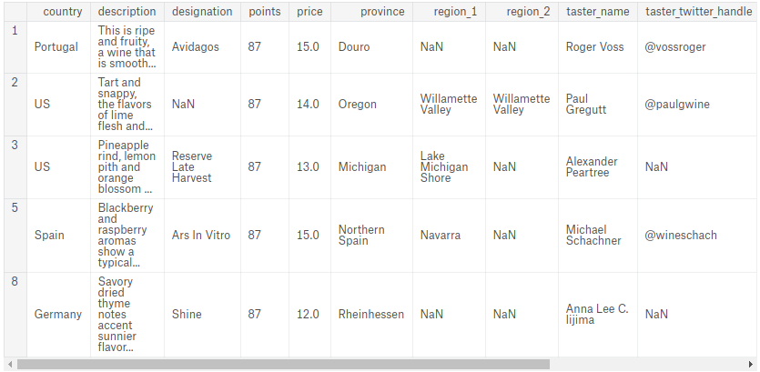
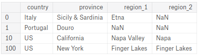

Jalankan sel berikut untuk memuat data Anda dan beberapa fungsi utilitas (termasuk kode untuk memeriksa jawaban Anda).


```python
import pandas as pd

reviews = pd.read_csv("../winemag-data-130k-v2.csv", index_col=0)
pd.set_option("display.max_rows", 5)
```

Lihatlah ikhtisar data Anda dengan menjalankan baris berikut.


```python
reviews.head()
```


<div>
<table border="1" class="dataframe">
  <thead>
    <tr style="text-align: right;">
      <th></th>
      <th>country</th>
      <th>description</th>
      <th>designation</th>
      <th>points</th>
      <th>price</th>
      <th>province</th>
      <th>region_1</th>
      <th>region_2</th>
      <th>taster_name</th>
      <th>taster_twitter_handle</th>
      <th>title</th>
      <th>variety</th>
      <th>winery</th>
    </tr>
  </thead>
  <tbody>
    <tr>
      <th>0</th>
      <td>Italy</td>
      <td>Aromas include tropical fruit, broom, brimston...</td>
      <td>Vulkà Bianco</td>
      <td>87</td>
      <td>NaN</td>
      <td>Sicily &amp; Sardinia</td>
      <td>Etna</td>
      <td>NaN</td>
      <td>Kerin O’Keefe</td>
      <td>@kerinokeefe</td>
      <td>Nicosia 2013 Vulkà Bianco  (Etna)</td>
      <td>White Blend</td>
      <td>Nicosia</td>
    </tr>
    <tr>
      <th>1</th>
      <td>Portugal</td>
      <td>This is ripe and fruity, a wine that is smooth...</td>
      <td>Avidagos</td>
      <td>87</td>
      <td>15.0</td>
      <td>Douro</td>
      <td>NaN</td>
      <td>NaN</td>
      <td>Roger Voss</td>
      <td>@vossroger</td>
      <td>Quinta dos Avidagos 2011 Avidagos Red (Douro)</td>
      <td>Portuguese Red</td>
      <td>Quinta dos Avidagos</td>
    </tr>
    <tr>
      <th>2</th>
      <td>US</td>
      <td>Tart and snappy, the flavors of lime flesh and...</td>
      <td>NaN</td>
      <td>87</td>
      <td>14.0</td>
      <td>Oregon</td>
      <td>Willamette Valley</td>
      <td>Willamette Valley</td>
      <td>Paul Gregutt</td>
      <td>@paulgwine</td>
      <td>Rainstorm 2013 Pinot Gris (Willamette Valley)</td>
      <td>Pinot Gris</td>
      <td>Rainstorm</td>
    </tr>
    <tr>
      <th>3</th>
      <td>US</td>
      <td>Pineapple rind, lemon pith and orange blossom ...</td>
      <td>Reserve Late Harvest</td>
      <td>87</td>
      <td>13.0</td>
      <td>Michigan</td>
      <td>Lake Michigan Shore</td>
      <td>NaN</td>
      <td>Alexander Peartree</td>
      <td>NaN</td>
      <td>St. Julian 2013 Reserve Late Harvest Riesling ...</td>
      <td>Riesling</td>
      <td>St. Julian</td>
    </tr>
    <tr>
      <th>4</th>
      <td>US</td>
      <td>Much like the regular bottling from 2012, this...</td>
      <td>Vintner's Reserve Wild Child Block</td>
      <td>87</td>
      <td>65.0</td>
      <td>Oregon</td>
      <td>Willamette Valley</td>
      <td>Willamette Valley</td>
      <td>Paul Gregutt</td>
      <td>@paulgwine</td>
      <td>Sweet Cheeks 2012 Vintner's Reserve Wild Child...</td>
      <td>Pinot Noir</td>
      <td>Sweet Cheeks</td>
    </tr>
  </tbody>
</table>
</div>


# Exercises

## 1.

Pilih kolom `description` dari `reviews` dan tetapkan hasilnya ke variabel `desc`.


```python
# Kode Anda di sini
desc = ___
```

Pertanyaan lanjutan: jenis objek apa yang dimaksud dengan `desc`? Jika Anda tidak yakin, Anda bisa memeriksanya dengan memanggil fungsi `type` Python: `type(desc)`.


```python
print(type(desc))
```

    <class 'pandas.core.series.Series'>
    

## 2.

Pilih nilai pertama dari kolom deskripsi dari `reviews`, tetapkan ke variabel `first_description`.


```python
first_description = ___

first_description
```

output:


    "Aromas include tropical fruit, broom, brimstone and dried herb. The palate isn't overly expressive, offering unripened apple, citrus and dried sage alongside brisk acidity."


## 3.

Pilih baris pertama data (record pertama) dari `reviews`, tetapkan ke variabel `first_row`.


```python
first_row = ___

first_row
```

output:


    country                                                    Italy
    description    Aromas include tropical fruit, broom, brimston...
                                         ...                        
    variety                                              White Blend
    winery                                                   Nicosia
    Name: 0, Length: 13, dtype: object


## 4.

Pilih 10 nilai pertama dari kolom `description` di `reviews`, tetapkan hasilnya ke variabel `first_descriptions`.

Petunjuk: format keluaran Anda sebagai sebuah Series pandas.


```python
first_descriptions = ___

first_descriptions
```

output:


    0    Aromas include tropical fruit, broom, brimston...
    1    This is ripe and fruity, a wine that is smooth...
                               ...                        
    8    Savory dried thyme notes accent sunnier flavor...
    9    This has great depth of flavor with its fresh ...
    Name: description, Length: 10, dtype: object


## 5.

Pilih record dengan label indeks `1`, `2`, `3`, `5`, dan `8`, dan tetapkan hasilnya ke variabel `sample_reviews`.

Dengan kata lain, buatlah DataFrame berikut ini:




```python
sample_reviews = ___

sample_reviews
```

output:


<div>
<table border="1" class="dataframe">
  <thead>
    <tr style="text-align: right;">
      <th></th>
      <th>country</th>
      <th>description</th>
      <th>designation</th>
      <th>points</th>
      <th>price</th>
      <th>province</th>
      <th>region_1</th>
      <th>region_2</th>
      <th>taster_name</th>
      <th>taster_twitter_handle</th>
      <th>title</th>
      <th>variety</th>
      <th>winery</th>
    </tr>
  </thead>
  <tbody>
    <tr>
      <th>1</th>
      <td>Portugal</td>
      <td>This is ripe and fruity, a wine that is smooth...</td>
      <td>Avidagos</td>
      <td>87</td>
      <td>15.0</td>
      <td>Douro</td>
      <td>NaN</td>
      <td>NaN</td>
      <td>Roger Voss</td>
      <td>@vossroger</td>
      <td>Quinta dos Avidagos 2011 Avidagos Red (Douro)</td>
      <td>Portuguese Red</td>
      <td>Quinta dos Avidagos</td>
    </tr>
    <tr>
      <th>2</th>
      <td>US</td>
      <td>Tart and snappy, the flavors of lime flesh and...</td>
      <td>NaN</td>
      <td>87</td>
      <td>14.0</td>
      <td>Oregon</td>
      <td>Willamette Valley</td>
      <td>Willamette Valley</td>
      <td>Paul Gregutt</td>
      <td>@paulgwine</td>
      <td>Rainstorm 2013 Pinot Gris (Willamette Valley)</td>
      <td>Pinot Gris</td>
      <td>Rainstorm</td>
    </tr>
    <tr>
      <th>3</th>
      <td>US</td>
      <td>Pineapple rind, lemon pith and orange blossom ...</td>
      <td>Reserve Late Harvest</td>
      <td>87</td>
      <td>13.0</td>
      <td>Michigan</td>
      <td>Lake Michigan Shore</td>
      <td>NaN</td>
      <td>Alexander Peartree</td>
      <td>NaN</td>
      <td>St. Julian 2013 Reserve Late Harvest Riesling ...</td>
      <td>Riesling</td>
      <td>St. Julian</td>
    </tr>
    <tr>
      <th>5</th>
      <td>Spain</td>
      <td>Blackberry and raspberry aromas show a typical...</td>
      <td>Ars In Vitro</td>
      <td>87</td>
      <td>15.0</td>
      <td>Northern Spain</td>
      <td>Navarra</td>
      <td>NaN</td>
      <td>Michael Schachner</td>
      <td>@wineschach</td>
      <td>Tandem 2011 Ars In Vitro Tempranillo-Merlot (N...</td>
      <td>Tempranillo-Merlot</td>
      <td>Tandem</td>
    </tr>
    <tr>
      <th>8</th>
      <td>Germany</td>
      <td>Savory dried thyme notes accent sunnier flavor...</td>
      <td>Shine</td>
      <td>87</td>
      <td>12.0</td>
      <td>Rheinhessen</td>
      <td>NaN</td>
      <td>NaN</td>
      <td>Anna Lee C. Iijima</td>
      <td>NaN</td>
      <td>Heinz Eifel 2013 Shine Gewürztraminer (Rheinhe...</td>
      <td>Gewürztraminer</td>
      <td>Heinz Eifel</td>
    </tr>
  </tbody>
</table>
</div>


## 6.

Buat variabel `df` yang berisi kolom `negara`, `provinsi`, `wilayah_1`, dan `wilayah_2` dari record dengan label indeks `0`, `1`, `10`, dan `100`. Dengan kata lain, buatlah DataFrame berikut ini:




```python
df = ___

df
```

output:


<div>
<table border="1" class="dataframe">
  <thead>
    <tr style="text-align: right;">
      <th></th>
      <th>country</th>
      <th>province</th>
      <th>region_1</th>
      <th>region_2</th>
    </tr>
  </thead>
  <tbody>
    <tr>
      <th>0</th>
      <td>Italy</td>
      <td>Sicily &amp; Sardinia</td>
      <td>Etna</td>
      <td>NaN</td>
    </tr>
    <tr>
      <th>1</th>
      <td>Portugal</td>
      <td>Douro</td>
      <td>NaN</td>
      <td>NaN</td>
    </tr>
    <tr>
      <th>10</th>
      <td>US</td>
      <td>California</td>
      <td>Napa Valley</td>
      <td>Napa</td>
    </tr>
    <tr>
      <th>100</th>
      <td>US</td>
      <td>New York</td>
      <td>Finger Lakes</td>
      <td>Finger Lakes</td>
    </tr>
  </tbody>
</table>
</div>


## 7.

Buat variabel `df` yang berisi kolom `negara` dan `varietas` dari 100 record pertama.

Petunjuk: Anda dapat menggunakan `loc` atau `iloc`. Ketika mengerjakan jawaban dari pertanyaan ini dan beberapa pertanyaan berikutnya, ingatlah "mengerti" yang dijelaskan pada tutorial:

> `iloc` menggunakan skema pengindeksan stdlib Python, di mana elemen pertama dari rentang dimasukkan dan yang terakhir dikeluarkan.
Sementara itu, `loc` mengindeks secara inklusif.

> Hal ini sangat membingungkan ketika indeks DataFrame berupa daftar numerik sederhana, misalnya `0,...,1000`. Dalam kasus ini `df.iloc[0:1000]` akan mengembalikan 1000 entri, sementara `df.loc[0:1000]` mengembalikan 1001 entri! Untuk mendapatkan 1000 elemen dengan menggunakan `loc`, Anda harus turun satu tingkat lebih rendah dan meminta `df.iloc[0:999]`.


```python
df = ___

df
```

output:


<div>
<table border="1" class="dataframe">
  <thead>
    <tr style="text-align: right;">
      <th></th>
      <th>country</th>
      <th>variety</th>
    </tr>
  </thead>
  <tbody>
    <tr>
      <th>0</th>
      <td>Italy</td>
      <td>White Blend</td>
    </tr>
    <tr>
      <th>1</th>
      <td>Portugal</td>
      <td>Portuguese Red</td>
    </tr>
    <tr>
      <th>...</th>
      <td>...</td>
      <td>...</td>
    </tr>
    <tr>
      <th>98</th>
      <td>Italy</td>
      <td>Sangiovese</td>
    </tr>
    <tr>
      <th>99</th>
      <td>US</td>
      <td>Bordeaux-style Red Blend</td>
    </tr>
  </tbody>
</table>
<p>100 rows × 2 columns</p>
</div>


## 8.

Buat DataFrame `italian_wines` yang berisi ulasan tentang anggur yang dibuat di `Italia`. Petunjuk: `reviews.country` sama dengan apa?


```python
italian_wines = ___
italian_wines
```

output:


<div>
<table border="1" class="dataframe">
  <thead>
    <tr style="text-align: right;">
      <th></th>
      <th>country</th>
      <th>description</th>
      <th>designation</th>
      <th>points</th>
      <th>price</th>
      <th>province</th>
      <th>region_1</th>
      <th>region_2</th>
      <th>taster_name</th>
      <th>taster_twitter_handle</th>
      <th>title</th>
      <th>variety</th>
      <th>winery</th>
    </tr>
  </thead>
  <tbody>
    <tr>
      <th>0</th>
      <td>Italy</td>
      <td>Aromas include tropical fruit, broom, brimston...</td>
      <td>Vulkà Bianco</td>
      <td>87</td>
      <td>NaN</td>
      <td>Sicily &amp; Sardinia</td>
      <td>Etna</td>
      <td>NaN</td>
      <td>Kerin O’Keefe</td>
      <td>@kerinokeefe</td>
      <td>Nicosia 2013 Vulkà Bianco  (Etna)</td>
      <td>White Blend</td>
      <td>Nicosia</td>
    </tr>
    <tr>
      <th>6</th>
      <td>Italy</td>
      <td>Here's a bright, informal red that opens with ...</td>
      <td>Belsito</td>
      <td>87</td>
      <td>16.0</td>
      <td>Sicily &amp; Sardinia</td>
      <td>Vittoria</td>
      <td>NaN</td>
      <td>Kerin O’Keefe</td>
      <td>@kerinokeefe</td>
      <td>Terre di Giurfo 2013 Belsito Frappato (Vittoria)</td>
      <td>Frappato</td>
      <td>Terre di Giurfo</td>
    </tr>
    <tr>
      <th>...</th>
      <td>...</td>
      <td>...</td>
      <td>...</td>
      <td>...</td>
      <td>...</td>
      <td>...</td>
      <td>...</td>
      <td>...</td>
      <td>...</td>
      <td>...</td>
      <td>...</td>
      <td>...</td>
      <td>...</td>
    </tr>
    <tr>
      <th>129961</th>
      <td>Italy</td>
      <td>Intense aromas of wild cherry, baking spice, t...</td>
      <td>NaN</td>
      <td>90</td>
      <td>30.0</td>
      <td>Sicily &amp; Sardinia</td>
      <td>Sicilia</td>
      <td>NaN</td>
      <td>Kerin O’Keefe</td>
      <td>@kerinokeefe</td>
      <td>COS 2013 Frappato (Sicilia)</td>
      <td>Frappato</td>
      <td>COS</td>
    </tr>
    <tr>
      <th>129962</th>
      <td>Italy</td>
      <td>Blackberry, cassis, grilled herb and toasted a...</td>
      <td>Sàgana Tenuta San Giacomo</td>
      <td>90</td>
      <td>40.0</td>
      <td>Sicily &amp; Sardinia</td>
      <td>Sicilia</td>
      <td>NaN</td>
      <td>Kerin O’Keefe</td>
      <td>@kerinokeefe</td>
      <td>Cusumano 2012 Sàgana Tenuta San Giacomo Nero d...</td>
      <td>Nero d'Avola</td>
      <td>Cusumano</td>
    </tr>
  </tbody>
</table>
<p>19540 rows × 13 columns</p>
</div>


## 9.

Buat DataFrame `top_oceania_wines` yang berisi semua ulasan dengan setidaknya 95 poin (dari 100) untuk wine dari Australia atau Selandia Baru.


```python
top_oceania_wines = # isi disini

top_oceania_wines
```

output:


<div>
<table border="1" class="dataframe">
  <thead>
    <tr style="text-align: right;">
      <th></th>
      <th>country</th>
      <th>description</th>
      <th>designation</th>
      <th>points</th>
      <th>price</th>
      <th>province</th>
      <th>region_1</th>
      <th>region_2</th>
      <th>taster_name</th>
      <th>taster_twitter_handle</th>
      <th>title</th>
      <th>variety</th>
      <th>winery</th>
    </tr>
  </thead>
  <tbody>
    <tr>
      <th>345</th>
      <td>Australia</td>
      <td>This wine contains some material over 100 year...</td>
      <td>Rare</td>
      <td>100</td>
      <td>350.0</td>
      <td>Victoria</td>
      <td>Rutherglen</td>
      <td>NaN</td>
      <td>Joe Czerwinski</td>
      <td>@JoeCz</td>
      <td>Chambers Rosewood Vineyards NV Rare Muscat (Ru...</td>
      <td>Muscat</td>
      <td>Chambers Rosewood Vineyards</td>
    </tr>
    <tr>
      <th>346</th>
      <td>Australia</td>
      <td>This deep brown wine smells like a damp, mossy...</td>
      <td>Rare</td>
      <td>98</td>
      <td>350.0</td>
      <td>Victoria</td>
      <td>Rutherglen</td>
      <td>NaN</td>
      <td>Joe Czerwinski</td>
      <td>@JoeCz</td>
      <td>Chambers Rosewood Vineyards NV Rare Muscadelle...</td>
      <td>Muscadelle</td>
      <td>Chambers Rosewood Vineyards</td>
    </tr>
    <tr>
      <th>...</th>
      <td>...</td>
      <td>...</td>
      <td>...</td>
      <td>...</td>
      <td>...</td>
      <td>...</td>
      <td>...</td>
      <td>...</td>
      <td>...</td>
      <td>...</td>
      <td>...</td>
      <td>...</td>
      <td>...</td>
    </tr>
    <tr>
      <th>122507</th>
      <td>New Zealand</td>
      <td>This blend of Cabernet Sauvignon (62.5%), Merl...</td>
      <td>SQM Gimblett Gravels Cabernets/Merlot</td>
      <td>95</td>
      <td>79.0</td>
      <td>Hawke's Bay</td>
      <td>NaN</td>
      <td>NaN</td>
      <td>Joe Czerwinski</td>
      <td>@JoeCz</td>
      <td>Squawking Magpie 2014 SQM Gimblett Gravels Cab...</td>
      <td>Bordeaux-style Red Blend</td>
      <td>Squawking Magpie</td>
    </tr>
    <tr>
      <th>122939</th>
      <td>Australia</td>
      <td>Full-bodied and plush yet vibrant and imbued w...</td>
      <td>The Factor</td>
      <td>98</td>
      <td>125.0</td>
      <td>South Australia</td>
      <td>Barossa Valley</td>
      <td>NaN</td>
      <td>Joe Czerwinski</td>
      <td>@JoeCz</td>
      <td>Torbreck 2013 The Factor Shiraz (Barossa Valley)</td>
      <td>Shiraz</td>
      <td>Torbreck</td>
    </tr>
  </tbody>
</table>
<p>49 rows × 13 columns</p>
</div>


```python

```
